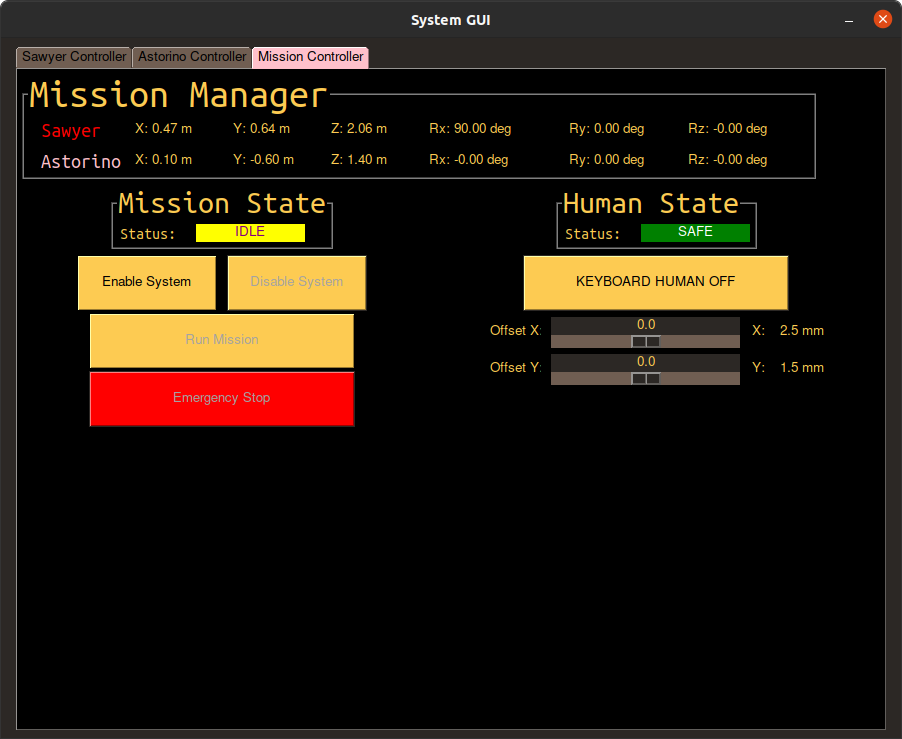

# Robotic Arms for Automated Removal of 3D Printed Components

## Overview

  

This project presents a comprehensive solution to 3D printing automation, specifically focused on the continuous collection of printed objects. By eliminating the need for manual intervention, it streamlines the production process and enhances efficiency. 

Two robotic manipulators are coordinated within a high-level robot motion control system. Once a print is finalized, the `picker_robot` picks up the plate, transferring it to the `bender_robot`. Together, they meticulously grip and bend the plate, ensuring the printed object is detached seamlessly. 

## Key Features

**Dual Robotic Manipulators**: Collaboratively working to ensure the smooth detachment of 3D printed objects. Motion calculations for the manipulators are handled by the [robotictoolbox](https://github.com/petercorke/roboticstoolbox-python) library developed by Peter Corke. This ensures precise and reliable calculations for robot movements.

**Real-time Visualisation**: Observe the manipulators in action in a visualized environment. The visualization of the entire operation is presented in [Swift](https://github.com/jhavl/swift) environment. It provides a real-time, visually rich representation of the manipulators in action.  

**Interactive Testing GUI:** Found in the main.py script, this GUI mimics user interaction similar to the functionality of a teach pendant on other robot models. The interface includes draggable buttons and sliders. By default, buttons are vertically aligned; for custom arrangements, modifications are required by delving into the `SwiftElement` package.  

**Collision Avoidance and Detection:** The system is equipped with advanced algorithms for:

- **Collision Avoidance:** This ensures that the robotic manipulators steer clear of obstructions, preventing potential damage or delays.

- **Collision Detection:** If a collision does occur, the system can detect it and respond appropriately to minimize damage or disruptions.  

**Safety Features:** Ensuring user and equipment safety is paramount in the design of this robotic system. The safety features integrated into the system include:  

- **Emergency Stop Button**  

  For both `Robot Controller` and `Mission Controller` Tabs, an `Emergency Stop` (e-stop) button is prominently displayed on the GUI. This feature operates as follows:

  Engage: Pressing the e-stop button during any motion will immediately stop the current movement of the robots. The system then transitions to a `Stopped` state.

  Release: Upon releasing the e-stop, the system enters an 'IDLE' state. Users can then press `Enable` to reactivate the system.

  Press `Run Mission` to continue operations from where the robots were interrupted.

  We tested [real hardware e-stop button]() compatible to interfere with the visualisation system. The button communicated via Arduino Uno and `pyserial` package 

- **Light Curtain**  

  A light curtain is installed around the workspace to ensure human safety:

  Purpose: This feature prevents unauthorized or accidental entry into the robot's working area.

  Testing: Users can test this feature by [teleoperate the human model]() in the visualisation. If the human model breaches the light curtain's boundary:

  The system immediately transitions to the `Stopped` state, akin to the e-stop being pressed.
  
  The operation remains halted until the user intervenes to ensure safety and resume operations.

- **Safety Equipment:** Fire extinguisher 

**Real robot control**: Real hardware implementation is demonstrated with ROS for the `picker_robot`. The model is chosen to be a Rethink Sawyer. Refer to its Wiki for [real picker robot control](https://github.com/minhtugonnabelit/IR-Assignment2/edit/main/wiki/wiki_hardware.md#real-robot-picker-rethink-robotics-sawyer).

## Operating Modes

The system operates in two primary modes:

- **Teach Pendant** (Interactive Testing GUI)  
   
  This mode offers an interactive GUI that mimics the interaction of a user in a similar way to how a teach pendant works on other robot models. This GUI allows for real-time testing and interaction with the robotic system.

  To initialize this mode, go to the corresponding `Controller tab` of either robot in the GUI and adjust sliders to control the robot joints 

  

- **Mission Mode**  

  In mission mode, the robotic manipulators automatically execute the task of gripping the plate and bending it in unison. This is to detach the printed object from the plate once the printing process is completed.

  To initialize this mode, go to the `Mission Controller tab`

  Both modes can be accessed and initialized directly from the GUI. Refer to the GUI documentation (or the GUI section of this README) for further instructions.

  

## Dependencies
To set up and run the visualization, the following dependencies are required:

`numpy`

`pygame`

`robotictoolbox`

`PySimpleGUI`

`OpenGL`

`pyserial`

Please ensure all dependencies are installed before running the visualization.

Thank you for your interest in our 3D Printing Automation project. We hope you find this simulation insightful and valuable
